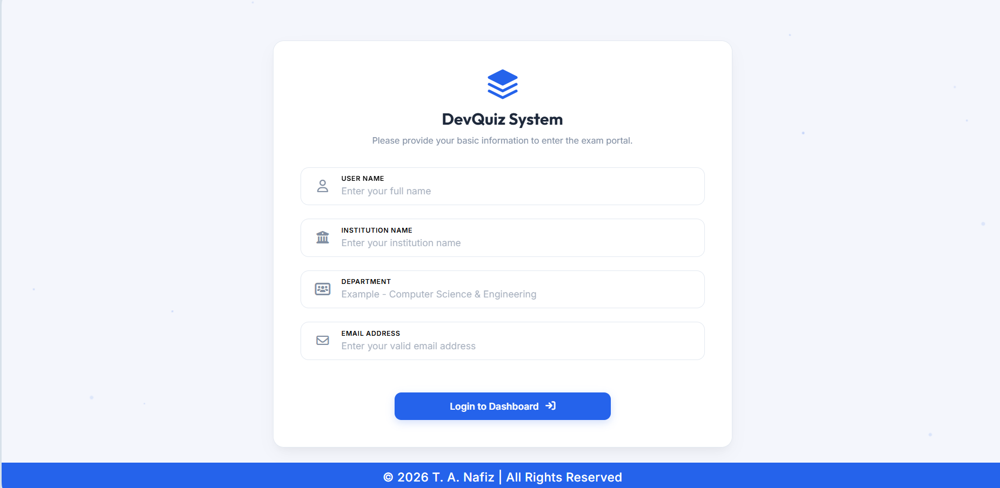
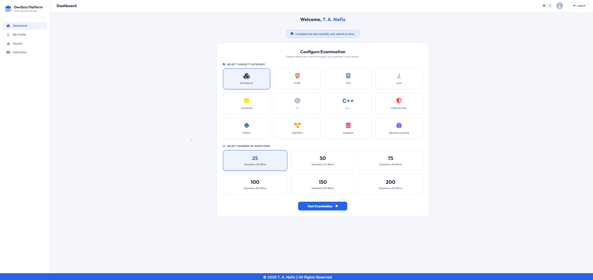

### Description:
A modern MCQ-based quiz web application built using HTML, CSS, and JavaScript. This platform allows users to test their knowledge, track performance, and improve skills through interactive quizzes.

-----

### Live Demo:
https://tanafiz.github.io/devquiz/

-----

### Features:
- User Login system,
- Multiple subject categories,
- Customizable question count & time limit,
- Auto timer & auto submission,
- Result history tracking,
- User profile management,
- Clean & responsive UI.

-----

### Login Page Preview:


### Dashboard Preview:


-----

### Technologies Used:

- HTML5,
- CSS3,
- JavaScript.

-----

### Project Structure:
```bash
DevQuiz-Platform/
│
├── index.html               # Login Page
├── dashboard.html           # Main Dashboard (Subject + Exam Setup)
├── profile.html             # User Profile Page
├── result.html              # Result Page
├── instruction.html         # Exam Instructions Page
│
├── css/
│   ├── style.css            # Main Styles
│   ├── dashboard.css        # Dashboard Styles
│   ├── quiz.css             # Quiz Page Styles
│
├── js/
│   ├── app.js               # Main JS Logic
│   ├── quiz.js              # Quiz Functionality
│   ├── timer.js             # Timer System
│   ├── storage.js           # LocalStorage (User + Results)
│
├── assets/
│   ├── images/              # Icons, Logos, Backgrounds
│   ├── icons/               # UI Icons
│
├── data/
│   ├── questions.js         # All MCQ Questions (by subject)
│
├── screenshots/             # README images
│   ├── login.png
│   ├── dashboard.png
│
├── README.md
└── LICENSE
```

-----

### How to Run:
1. Clone the repository:
```bash
git clone https://github.com/tanafiz/devquiz.git
```
2. Open the project folder in any code editor.
3. Run the project.

-----

### Designed & Developed by T. A. Nafiz
